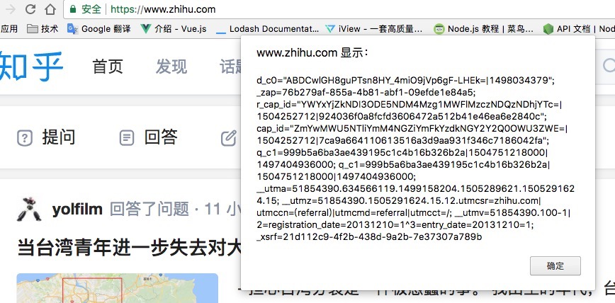

#Cookie
参考文档：http://blog.csdn.net/fangaoxin/article/details/6952954/

cookie是一种会话跟踪技术，在客户端记录信息确定用户身份。

## 会话
一个用户在任何时段的所有请求操作都属于同一会话。而另一个用户的请求操作属于另一会话。

但是HTTP协议是无状态协议，传输完数据就断开连接了，所以当再次链接发送请求时，服务器就不知道这个请求是之前的谁发的，就不知道是属于会话A，还是属于会话B。

所以，引入了cookie机制，用来弥补HTTP协议的不足。

## cookie机制
   Cookie实际上是一小段的文本信息。客户端请求服务器，如果服务器需要记录该用户状态，就使用response向客户端浏览器颁发一个Cookie。客户端浏览器会把Cookie保存起来。当浏览器再请求该网站时，浏览器把请求的网址连同该Cookie一同提交给服务器。服务器检查该Cookie，以此来辨认用户状态。服务器还可以根据需要修改Cookie的内容。
    比如，微博服务器给你颁发一个cookie，百度服务器给你颁发一个cookie。。。
    
## 查看cookie
在地址栏输入*JavaScript:alert(document.cookie)*

例如，查看知乎的cookie：


## 注意
cookie需要浏览器的支持。不同的浏览器保存cookie的方法可能不同。

cookie具有不可跨域名性。也就是说访问谷歌不可能带百度的cookie，更不能该百度的cookie，只能携带自己的cookie。域名不同，cookie就不同。

cookie中保存中文需要使用Unicode进行编码。


## cookie的属性（看起来是针对每一个cookie进行的设置）
> cookie的每个属性都有一个getter 和 setter 方法。

属性：
name----这个cookie的名称，创建后不可修改。

value----cookie的值，如果值为Unicode字符，则需要为字符编码；如果值为二进制数据，则需要使用BASE64编码。

maxAge----cookie都是临时的，关闭浏览器就会失效。如果值为0，表示删除该cookie，默认值为-1。

secure----cookie是否仅被使用安全协议传输，安全协议有HTTPS,SSL等，如果为true，则在网络上传输数据之前会将数据加密。默认false

path----该cookie的使用路径，如果设置为/sessionWeb/，则只有contextPath为/sessionWeb的程序可以访问该cookie。如果设置为/，则本域名下contextPath都可以访问该cookie。

domain----可以访问该cookie的域名，如果设置为'.google.com'，则所有以google.com结尾的域名都可以访问该cookie。

comment----该cookie的用处说明，浏览器显示cookie信息的时候显示该说明。

version----该cookie使用的版本号。

## cookie的有效期
cookie的maxAge决定cookie的有效期，单位为秒。可以通过getMaxAge方法与setM方法来获取修改maxAge属性。

如果maxAge为正数，则只要没到maxAge规定的时间，无论关了电脑还是浏览器，再次打开网站时cookie依然有效。cookie保存在文件中。

如果maxAge是负数，则表示该cookie尽在本浏览器窗口以及本窗口打开的子窗口有效，关闭窗口后该cookie失效。cookie保存在浏览器内存中。

如果maxAge为0，表示从浏览器或文件中删除cookie。因为cookie机制中没有设置删除cookie的方法，因此就通过这种设置来删除cookie

例如：
```angular2html
Cookie cookie = new Cookie('username', 'baidu'); // 新建cookie
cookie.setMaxAge(0); // 设置生命周期为0，不能为负数
response.addCookie(cookie); // response对象提供的cookie操作方法只有一个添加操作add(Cookie cookie);
```
修改cookie只能通过同名cookie覆盖的方式.

## cookie的域名
正常情况下，用一个一级域名下的两个二级域名也不能使用同一个cookie，如果想使用同一个cookie，就需要设置domain属性。

## cookie路径
页面只能获取它属于的path的cookie。

## cookie的安全属性
设置属性secure为true时，浏览器只会在HTTPS和SSL等安全协议中传输此类cookie。
如果需要提高cookie的安全性，需要在程序中对cookie内容加密，解密。

## JavaScript操作cookie
JavaScript可以任意读写cookie。

但是出于安全考虑，浏览器会阻止JavaScript读写任何不属于自己网站的cookie。也就是说，A网站的JavaScript程序读写B网站的cookie不会有任何结果。

```angular2html
<script>document.write(document.cookie)</script>
```


